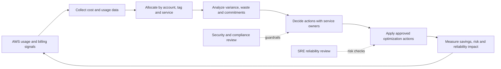
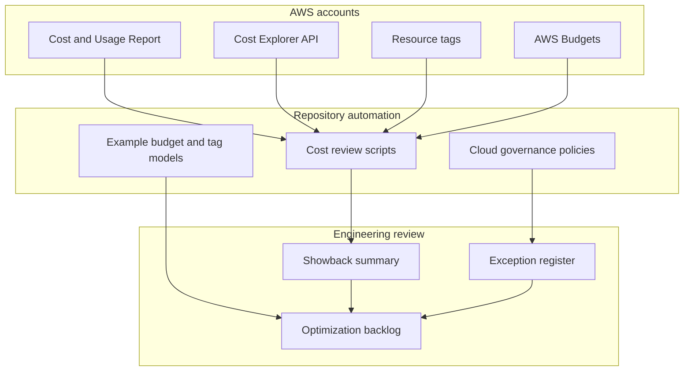
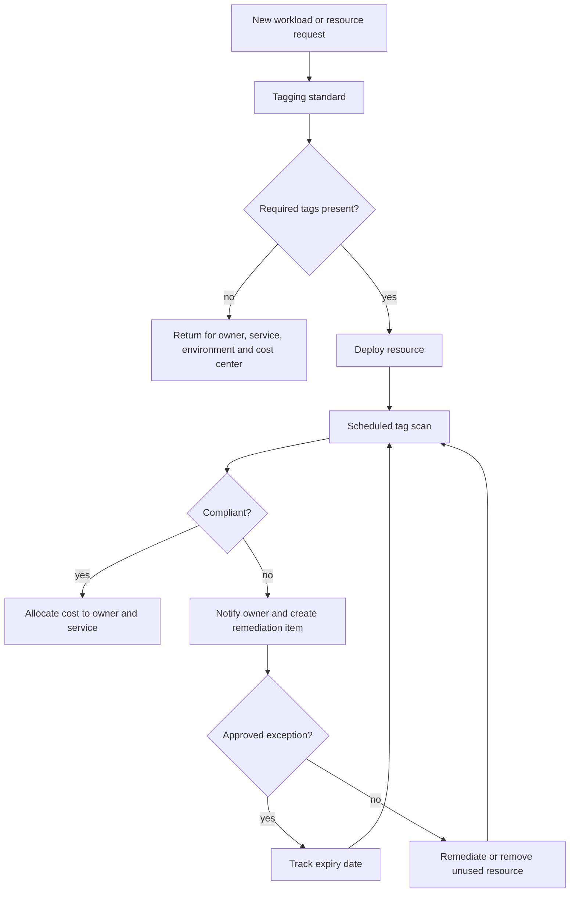
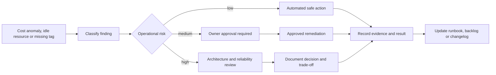

# FinOps Visual Diagrams

These diagrams show how cost signals move from cloud usage into review, action and governance. They are intentionally generic so teams can adapt them to their AWS account model, tagging standard and approval process.

## Operating Loop

## Cost Data Flow

## Tagging Governance

## Automation Decision Model

## Review Use

Use these diagrams during repository review to check that examples and scripts support a closed operating loop: collect data, allocate cost, decide action, apply the change and measure the result. Any automation that changes infrastructure should keep an explicit approval path when reliability, security or customer impact is uncertain.
